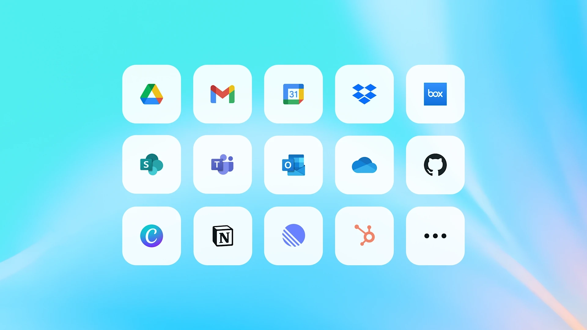

# ChatGPT团队协作新功能：共享项目、工具连接器和企业级安全升级

---

你的团队是不是经常遇到这种情况：每次开会前要翻遍邮件找客户资料，写完内容后发现风格跟上周的完全不搭，或者每个人都在问"那个文档在哪"？ChatGPT最近推出的几个新功能，专门解决团队协作中的这些痛点。现在团队可以通过共享项目保持同步，直接从常用工具里调取信息，而且企业管理员也能更放心地管控数据安全。

---

## 共享项目：让团队真正在同一页上

去年ChatGPT推出了项目功能，让你把相关的对话、文件和指令放在一起，避免每次都要重新解释背景。现在这个功能升级了——你可以把项目分享给队友，大家一起往里添加文件和指令，ChatGPT会根据这些共享的信息来调整回答。

早期测试中，团队主要用它来处理这几类工作：

**客户管理**：把所有笔记、提案、合同扔进一个项目里。客户经理上传完会议记录后，方案工程师可以直接问ChatGPT"最新进展是啥"，准备客户演示的效率高多了。

**内容创作**：在项目里设定统一的品牌调性和风格指南。比如你可以告诉ChatGPT"按我们的品牌规范来"，团队里每个人写博客、做社交媒体文案时，风格就能保持一致。

**定期报告**：上传数据集，设好共享指令，不同人负责不同部分。准备月报的时候，有人写高管摘要，有人写财务详细版，大家各干各的但不会乱套。

### 具体怎么用

项目创建者可以通过邮件或链接邀请队友，有两种权限：聊天权限（可以看项目里的对话、文件和指令）和编辑权限（还能修改指令、上传删除文件、邀请其他人）。

共享项目有自己的独立记忆——ChatGPT会记住成员分享的细节，下次开新对话就不用重复解释了。对于需要长期跟进、多次沟通的工作特别有用，客户信息或敏感数据也能安全地留在项目内部。

👉 如果你团队正在找更高效的AI协作方案，[ChatGPT团队版会员现在有特价账号](https://shaoyumi.com/buy/65)，可以直接体验这些新功能，质保30天用得放心。

**下一步计划**：这个版本里，团队成员可以异步工作——在别人更新的基础上继续做，或者开启自己和ChatGPT的单独对话，也可以从别人的对话分支出去探索新想法。这只是团队协作功能的第一步，后续会根据反馈继续迭代。

**可用性说明**：共享项目现在已经对Business、Enterprise和Edu版开放，Free、Go、Plus和Pro版很快也会上线。Enterprise和Edu客户默认是关闭的，管理员可以控制访问权限。项目只能在ChatGPT商业版的工作空间成员之间共享。

## 工具连接器：直接从你的工作应用里调信息

团队每天生成大量文档、聊天记录和邮件，想找东西的时候简直是大海捞针。现在ChatGPT可以通过连接器直接从你们常用的工具里拉信息——Gmail、Google日历、Microsoft Outlook、Teams、SharePoint、GitHub、Dropbox、Box等等。

你可以用它来熟悉新代码库、用最新模板写营销简报、或者快速总结重要邮件。感觉就像有个了解你工作的队友，几乎什么问题都能给出专业答案。

最近的更新让连接器更好用了：响应更快更准，而且ChatGPT现在知道什么时候该自动调用哪个连接器。新增的邮件和日历连接器能拉取即将到来的会议和最近的对话信息，写会议议程、跟进行动项或者快速找细节，都不用再切换应用了。

### 团队现在这么用连接器

**沟通和写作**：起草更新、整合文档、遵循模板（比如"用Google Drive里的网页模板，给[x]写个简报"）。

**会议和协作**：准备会议、创建议程、识别行动项（比如"看看我和[客户/公司]最近的邮件，帮我准备下次通话"）。

**组织和效率**：快速在公司数据里找重要文档或答案（比如"费用报告怎么提交？"）。

**分析和报告**：分析市场研究或绩效追踪数据（比如"告诉我HubSpot里哪些活动带来了最高价值的交易"）。

**编码和技术任务**：理解代码库、审查PR、写文档（比如"我们代码里[功能]是怎么实现的？"）。

> "LogicMonitor是一家AI优先的公司，ChatGPT在我们全球转型中处于核心地位。连接器是这次转型的催化剂，把AI直接带进我们已经依赖的工具里。通过ChatGPT和Google Drive的结合，我们的团队协作更聪明、行动更快、解锁了新的性能水平。"
> 
> ——Alyene Schneidewind，LogicMonitor首席绩效官

### 最近的更新

**新增更多生产力工具**：Gmail、Google日历、Google通讯录、Microsoft Outlook和日历、Microsoft Teams的新连接器，让ChatGPT对项目、通信和日程有更完整的了解，团队花在多个工具间找信息的时间少多了。

**ChatGPT知道何时调用连接器**：ChatGPT现在能自动判断什么时候该用连接器、什么时候搜网页、什么时候用自己的训练数据——公司的上下文信息更自然地融入对话了。它还能根据问题选最相关的连接器，不用你在每次新对话里手动开启了。

**响应更快更准**：ChatGPT现在可以提前同步GitHub、SharePoint、Dropbox和Box的数据，响应速度和准确度都提升了。

**下一步计划**：接下来几周，会推出更多针对CRM、通信、知识库和工单系统的连接器，把ChatGPT接入你业务运行的方方面面。很快连接器也会在项目和GPTs里可用。

## 合规和管理功能：数据安全有保障

在让ChatGPT对职场更有价值的同时，帮助企业负责任、有信心地在全公司部署也同样重要。新增的合规和管理功能让公司对"谁能访问什么、数据存在哪、如何保护"有更多控制权。

**IP白名单**：管理员现在可以为ChatGPT Enterprise和Edu工作空间启用IP白名单作为可选安全功能。开启后，只有你指定的IP地址发起的请求才会被允许。任何来自未批准IP的请求都会被自动拦截，即使用户有有效凭证。

**新增合规认证**：获得了ISO 27001、27017、27018和27701认证，扩展了SOC 2报告，增加了基于角色的访问控制和增强的SSO，帮助企业放心地让每位员工使用AI。

OpenAI现在服务超过500万ChatGPT商业用户，随着公司从试验转向日常关键任务使用，会继续让ChatGPT成为一个安全、面向未来的平台，随着AI的进步而变得更好，帮助团队每天更聪明地工作。

---

## 总结

ChatGPT的这些更新——共享项目、工具连接器和企业级安全功能——真正在解决团队协作中的实际问题：信息分散、风格不一致、数据安全顾虑。无论你是小团队还是大企业，这些功能都能让AI协作变得更自然、更高效。如果你的团队正在寻找能真正提升协作效率的AI工具，👉 [ChatGPT团队版会员特价账号](https://shaoyumi.com/buy/65)现在是个不错的选择——既能体验完整功能，又有30天质保让你安心试用。
